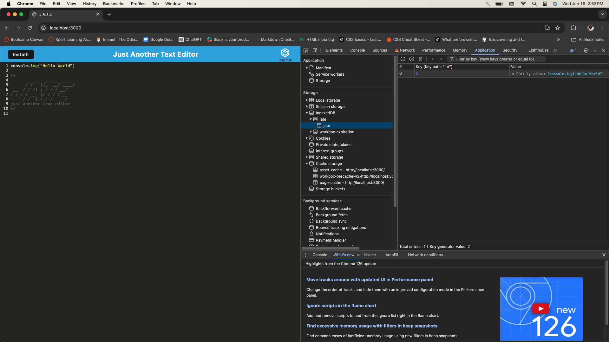

# Just Another Text Editor (J.A.T.E)

## Installation

# Description
J.A.T.E is a web text editor where you can create a notes or even code snippets. J.A.T.E is a Progressive Web Application (PWA) that runs in the browser, offline and can be installed locally to your machine. The integrated service worker and Cache API's ensure that the application will remain fully functional even without and active internet connection.

  ## Table of Contents

* [Installation](#installation)
* [Usage](#usage)
* [Screenshots](#screenshots)
* [License](#license)
* [Contributing](#contributing)
* [Contact](#contact)

## Installation
  User can view and use the application through the browser by visiting at the deployed application in Render at

  1. Open the deployed app in the browser.
  2. Click the `Install` button in the top left corner to download.

  Viewing the application in the browser will also give you a function to install it and it cal also be used offline.
  But you can also start by cloning the repo in the CLI, or forking the repo.

## Usage
   This app is very user friendly. You can either choose one of the option either directly visit to the deployed page, or clone or fork the repo. Then start adding the notes right away as easy as that. The notes saves right away  through indexedDB even after closing the app and if you reopen the app the notes will still be there. And the best part of this app is that you can use the app either online or offline. 

## Screenshots
Here are some of the screenshots of the application.

The following file shows the application's `indexedDb` storage:

The following file shows the application's registered `ServiceWorker` storage:

## License

## Contributing

There are no guidelines for contributing at this time. Contact me with any ideas or requests if anybody want to contribute.

## Contact
* Email: jujunakarmi@gmail.com
* LinkedIn:[https://www.linkedin.com/in/juju-nakarmi-1a79a7181/](https://www.linkedin.com/in/juju-nakarmi-1a79a7181/)